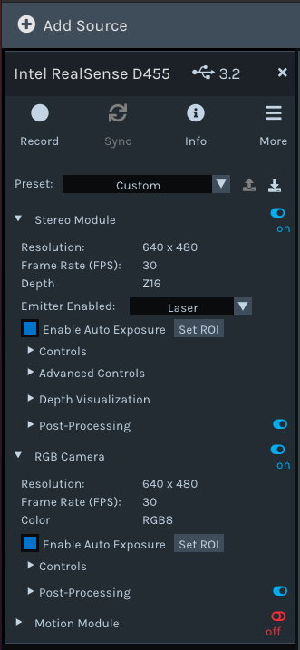
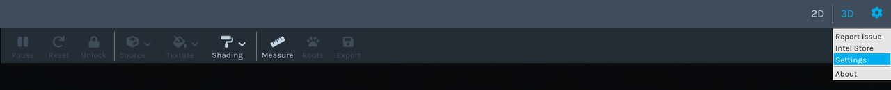
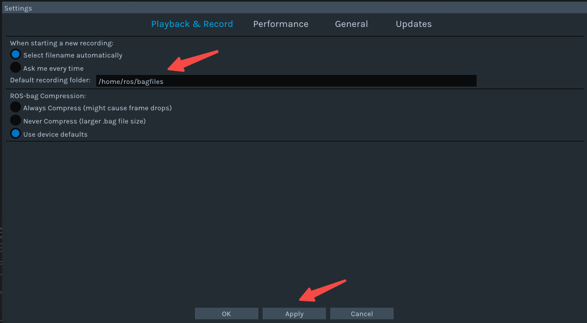
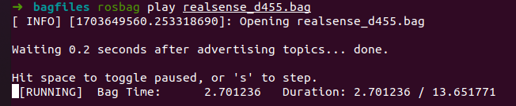

# Collect RGBD Information

## Documents
1. [Intel Realsense D400 Series](https://github.com/ChangerC77/collect_RGBD/blob/master/Intel-RealSense-D400-Series-Datasheet-October-2024.pdf)
2. [Intel Realsense T265](https://github.com/ChangerC77/collect_RGBD/blob/master/IntelRealSenseTrackingT265Datasheet.pdf)
3. [Intel Realsense L515](https://github.com/ChangerC77/collect_RGBD/blob/master/Intel_RealSense_LiDAR_L515_Datasheet_Rev003.pdf)

## Realsense D400 series
### 1. Realsense-SDK
#### Homepage
https://github.com/IntelRealSense/librealsense

#### SDK
https://github.com/IntelRealSense/librealsense/releases

#### Linux Installation
https://github.com/IntelRealSense/librealsense/blob/master/doc/distribution_linux.md
#### 1. Install
Reference: https://zhuanlan.zhihu.com/p/626664186
1. download the code
```
git clone https://github.com/IntelRealSense/librealsense
```
2. Execute the installation dependencies separately:
```
cd librealsense
sudo apt-get install libudev-dev pkg-config libgtk-3-dev
sudo apt-get install libusb-1.0-0-dev pkg-config
sudo apt-get install libglfw3-dev
sudo apt-get install libssl-dev
```
3. build librealsense:
```
mkdir build
cd build
cmake ../ -DBUILD_EXAMPLES=true
make
sudo make install 
```
``this step will cost almost 10 minutes depending on your network, so be patient to wait! ``

Sometimes the network is not good and you need to try several times. Test the installed librealsense
``ATTENTION``: Please note that the wiring must be type-c 3.0, otherwise an error may occur and the image data cannot be displayed.
#### 2. Run
```
realsense-viewer
```
bug: After opening realsense-viewer, there is a ``red`` reminder in the upper right corner
```
Description: Multiple realsense udev-rules were found!
1: /etc/udev/rules.d/99-realsense-libusb.rules
2:/lib/udev/rules.d/60-librealsense2-udev-rules.rules
Make sure to remove redundancies!
```
solution
```
sudo rm -rf /etc/udev/rules.d/99-realsense-libusb.rules
sudo apt-get autoremove librealsense2-dkms
```
### Get camera internal parameters
#### 1. open realsense-viewer
```
realsense-viewer
```


Adjust the resolution to ``640*480`` and turn on record


You can set the record output folder location


#### 2. Generate a bag file after output, and then use ``rosbag`` command to play
```
rosbag play -l xxx.bag
```


#### 3. Then output the internal reference information of rgb and depth respectively
+ D455 RGB internal parameters (Used for Point Cloud Fusion)
```
rostopic echo /device_0/sensor_1/Color_0/info/camera_info
```
```
header: 
  seq: 0
  stamp: 
    secs: 0
    nsecs:         0
  frame_id: ''
height: 480
width: 640
distortion_model: "Inverse Brown Conrady"
D: [-0.055006977170705795, 0.06818309426307678, -0.0007415282307192683, 0.0006959497695788741, -0.02157658338546753]
K: [378.81097412109375, 0.0, 311.96051025390625, 0.0, 378.4126892089844, 246.17489624023438, 0.0, 0.0, 1.0]
R: [0.0, 0.0, 0.0, 0.0, 0.0, 0.0, 0.0, 0.0, 0.0]
P: [0.0, 0.0, 0.0, 0.0, 0.0, 0.0, 0.0, 0.0, 0.0, 0.0, 0.0, 0.0]
binning_x: 0
binning_y: 0
roi: 
  x_offset: 0
  y_offset: 0
  height: 0
  width: 0
  do_rectify: False
---
```
Corresponding fx, fy, cx, cy
```
fx, fy = 378.81097412109375, 378.4126892089844  # Focal lengths in x and y
cx, cy = 311.96051025390625, 246.17489624023438  # Principal point (image center)
```
$$K = \begin{bmatrix} 
fx & 0 & cx\\ 
0 & fy & cy\\
0 & 0 & 1
\end{bmatrix}$$
+ D455 depth internal parameters
```
rostopic echo /device_0/sensor_0/Depth_0/info/camera_info
```
```
header: 
  seq: 0
  stamp: 
    secs: 0
    nsecs:         0
  frame_id: ''
height: 480
width: 640
distortion_model: "Brown Conrady"
D: [0.0, 0.0, 0.0, 0.0, 0.0]
K: [387.4676208496094, 0.0, 314.91455078125, 0.0, 387.4676208496094, 239.83538818359375, 0.0, 0.0, 1.0]
R: [0.0, 0.0, 0.0, 0.0, 0.0, 0.0, 0.0, 0.0, 0.0]
P: [0.0, 0.0, 0.0, 0.0, 0.0, 0.0, 0.0, 0.0, 0.0, 0.0, 0.0, 0.0]
binning_x: 0
binning_y: 0
roi: 
  x_offset: 0
  y_offset: 0
  height: 0
  width: 0
  do_rectify: False
---
```
Corresponding fx, fy, cx, cy
```
fx, fy = 387.4676208496094, 387.4676208496094  # Focal lengths in x and y
cx, cy = 314.91455078125, 239.83538818359375  # Principal point (image center)
```
$$K = \begin{bmatrix} 
fx & 0 & cx\\ 
0 & fy & cy\\
0 & 0 & 1
\end{bmatrix}$$

## Realsense T265
see more deails in [T265 Usage](https://github.com/ChangerC77/collect_RGBD/blob/master/T265.md)
## 2. Pyrealsense2
### website
https://github.com/IntelRealSense/librealsense/blob/master/wrappers/python/readme.md


### Install
```
pip install pyrealsense2
```
change the source 
```
pip install pyrealsense2 -i http://pypi.douban.com/simple/ --trusted-host pypi.douban.com
```
## Code Examples
Code examples
https://github.com/IntelRealSense/librealsense/tree/master/wrappers/python/examples
### Run
```
python pyrealsense2/realsense.py          # Real-time display aligned RGBD information
python pyrealsense2/aliged_save.py        # Real-time display and save aligned Realsense RGBD information
python pyrealsense2/d400.py               # realsense d400 series drivers (d405, d435i)
```

## Orbbec
### website
https://github.com/orbbec/pyorbbecsdk?tab=readme-ov-file

```
python orbbec/orbbec_save.py    # Real-time display and save aligned Realsense RGBD information
python orbbec/orbbec.py         # Real-time display aligned RGBD information
```

