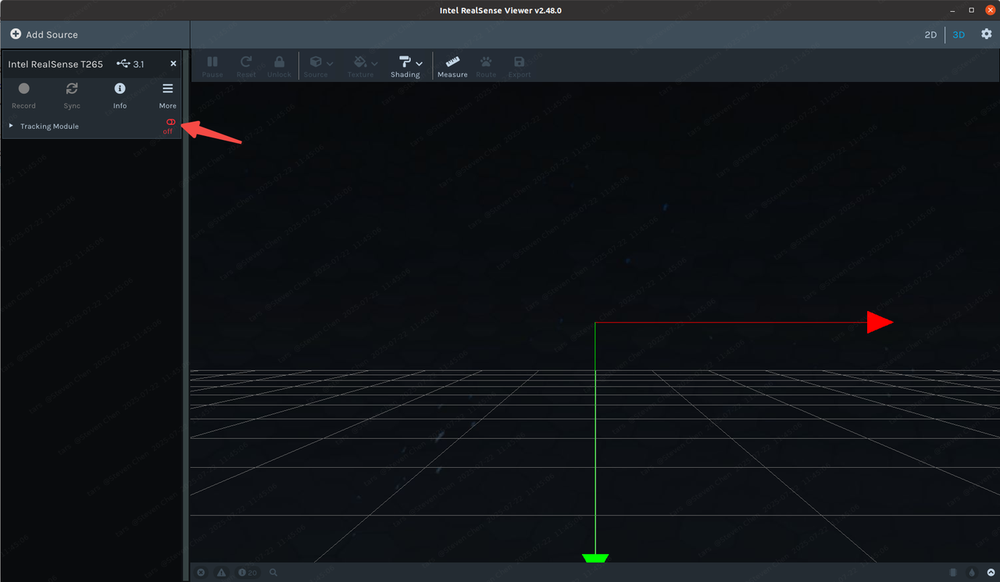
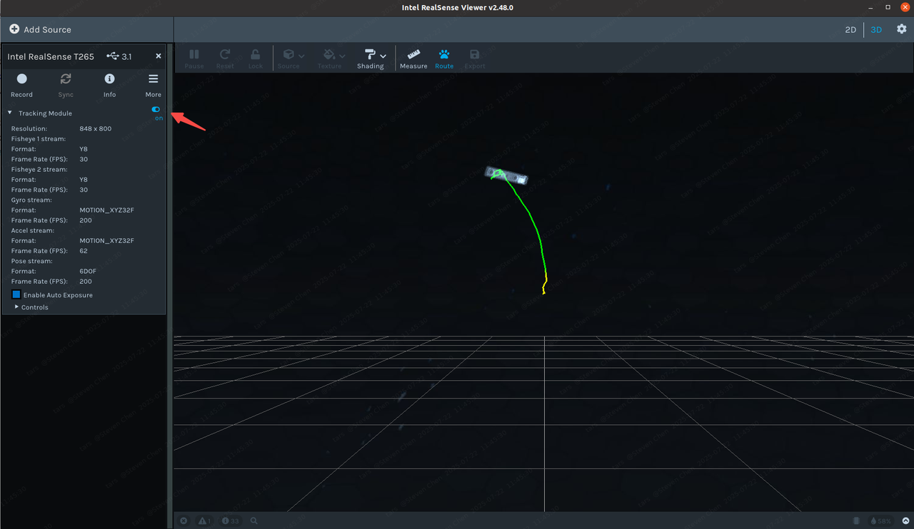
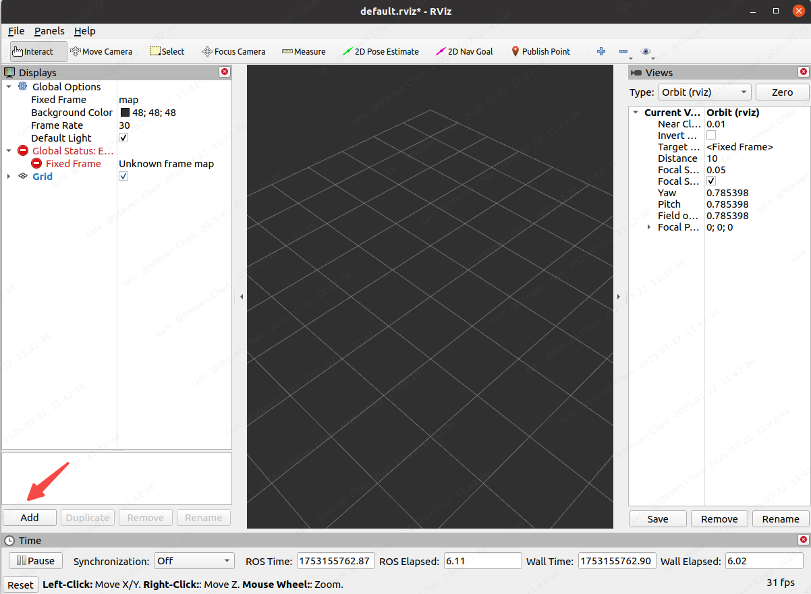
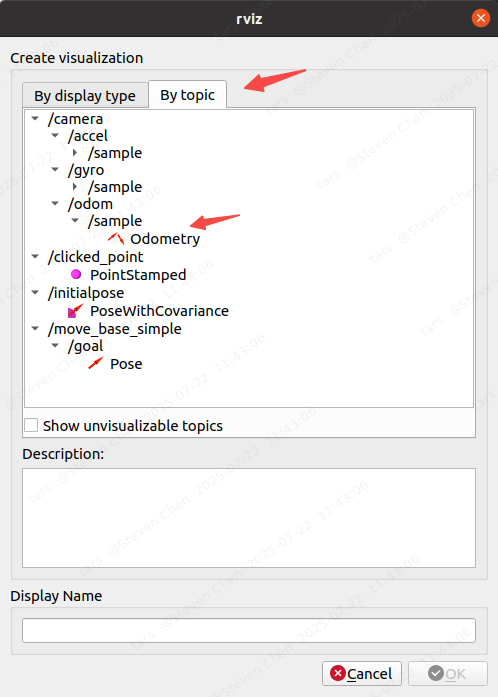
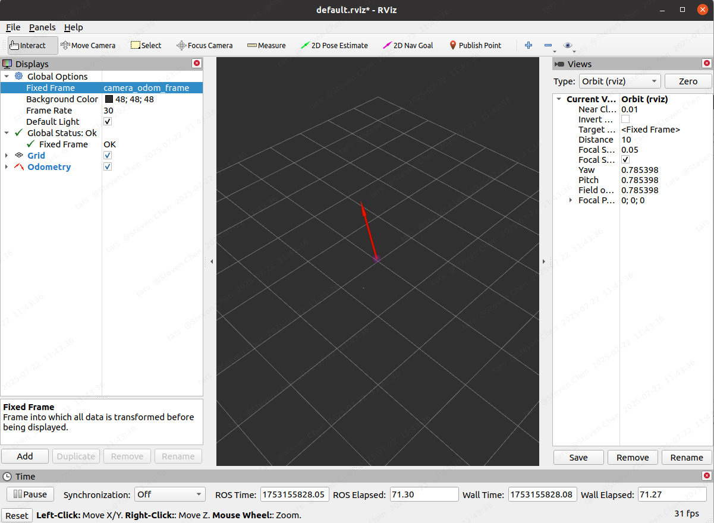

# T265 Usage
## 1. Install realsense SDK
(注意：安装时需要拔掉相机)
由于T265停产，Intel RealSense SDK 2.0（v.2.54.1）在该版本中移除了对T265相机的支持，因此下载`v2.48.0`版本。首先下载安装包
```
git clone -b v2.48.0 https://github.com/ChangerC77/librealsense.git
```
### 1. install dependence
```
cd librealsense
sudo apt-get install libudev-dev pkg-config libgtk-3-dev
sudo apt-get install libusb-1.0-0-dev pkg-config
sudo apt-get install libglfw3-dev
sudo apt-get install libssl-dev
```
### 2. 安装权限脚本
```
sudo cp config/99-realsense-libusb.rules /etc/udev/rules.d/
sudo udevadm control --reload-rules && udevadm trigger
```
### 3. build librealsense
```
mkdir build
cd build
cmake ../ -DCMAKE_BUILD_TYPE=Release -DBUILD_EXAMPLES=true
sudo make uninstall
make clean && make -j8
sudo make install
```
## 2. realsense-viewer
将t265插到`USB3.0`插口，测试安装好的`librealsense`
```
realsense-viewer
```
启动时会打开`realsense`软件，把界面左边的`off`按钮拨到`on`, 即可出现相机的轨迹。




如果显示mission一个模块，右上角会有标注，输入如下指令安装该模块：
```
sudo cp ~/.99-realsense-libusb.rules /etc/udev/rules.d/99-realsense-libusb.rules && sudo udevadm control --reload-rules && udevadm trigger
```
再次打开`realsense-viewer`就可以看到t265的数据了

## 3. error solution
### 1. Error booting T265
把`usb2.0`接口换为`usb3.0`接口
### 2. 打开realsense-viewer后右上角有红色提醒
```
Description: Multiple realsense udev-rules were found!
1: /etc/udev/rules.d/99-realsense-libusb.rules
2:/lib/udev/rules.d/60-librealsense2-udev-rules.rules
Make sure to remove redundancies!
```
solution:
```
sudo rm -rf /etc/udev/rules.d/99-realsense-libusb.rules
sudo apt-get autoremove librealsense2-dkms
```
### 3. 无法获得锁`/var/lib/dkpg/lock-frontend`. 锁正由进程12836（unattended-upgr）持有。
solution:
```
sudo rm /var/cache/apt/archives/lock
sudo rm /var/lib/dpkg/lock
```
## 4. ROS
首先安装`ros-noetic-realsense2-camera`
```
sudo apt-get install ros-noetic-realsense2-camera
```
### 1. rs_t265.launch
```
roslaunch realsense2_camera rs_t265.launch
```
打开一个新的终端，查看发布的`ros`话题，可以看到`realsense-camera`和`odom`之类的数据
```
rostopic list
```
output
```
/camera/accel/imu_info
/camera/accel/metadata
/camera/accel/sample
/camera/gyro/imu_info
/camera/gyro/metadata
/camera/gyro/sample
/camera/odom/metadata
/camera/odom/sample
/camera/realsense2_camera_manager/bond
/camera/tracking_module/parameter_descriptions
/camera/tracking_module/parameter_updates
/diagnostics
/rosout
/rosout_agg
/tf
/tf_static
```
### 2. rviz
```
rviz
```




## 5. Reference
https://zhuanlan.zhihu.com/p/626664186